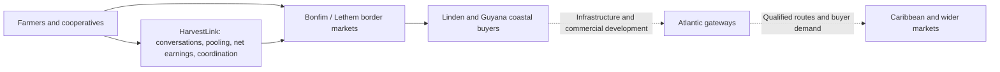
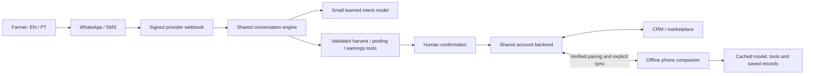

# HarvestLink


### A conversation can open a market.

HarvestLink helps smallholder farmers in Guyana and northern Brazil turn individual harvests into coordinated buyer orders. Farmers talk to an assistant through **WhatsApp or SMS**, in English or Portuguese. The assistant builds their account in the background, asks for missing harvest details, finds compatible demand, compares what they keep after costs, and helps prepare the next step. Farmers confirm the decisions that affect their records and sales.

The **web workspace is the CRM and marketplace**: a place to inspect accounts, availability, buyer proposals, costs, logistics and exporter handovers. The installed phone companion carries the essential conversation and records into places without reliable internet.

[Open the workspace](https://declanroye.github.io/HarvestLink/?release=v26) · [Try the WhatsApp demo](prototype/DEMO-WHATSAPP.md) · [Connect your phone](prototype/SHARED-SETUP.md)

## The problem: a better road does not automatically create a better sale

A farmer has a harvest. A buyer needs a dependable quantity, grade and delivery window. A transporter needs a viable load. An exporter needs clear ownership, farmer consent and unresolved checks made visible. Those pieces can remain scattered across conversations, languages and disconnected records.

A higher quoted export price can also hide a worse outcome once freight, packaging, handling, losses, fees and currency conversion are deducted. A small farmer needs an understandable net comparison, not just a price listing. Our product hypothesis is that pooling compatible availability and making the coordination explicit can help more farmers participate in larger orders. That hypothesis still needs field validation; we do not claim measured income or waste reductions.

## Why this region, why this corridor

The emerging Guyana–Brazil connection links **Manaus → Boa Vista → Bonfim → Lethem → Linden → Guyana's coast**. Brazil's wider **Rota Ilha das Guianas** connects northern Brazilian states with Guyana, Suriname, French Guiana and Venezuela. The connection at Bonfim–Lethem already exists; the opportunity comes from improving the wider network and the commercial coordination around it. [Brazil's integration programme](https://www.gov.br/planejamento/pt-br/assuntos/noticias/2025/novembro/ministerio-do-planejamento-e-orcamento-apresentara-o-programa-rotas-de-integracao-sul-americana-na-cop-30)

The Linden–Lethem corridor is a bilateral infrastructure priority. The Linden–Mabura upgrade has documented CDB/UK financing, while completion of the whole route and river crossings remains a separate challenge. Guyana's Agriculture Ministry connects the corridor and proposed port development at Parika to agricultural trade with Roraima. These are infrastructure projects at different stages, not an already completed export highway. [Bilateral priority](https://dpi.gov.gy/linden-lethem-road-completion-priority-for-guyana-and-brazil/), [CDB project financing](https://www.caribank.org/work-with-us/procurement/procurement-notices/linden-mabura-hill-upgrade-project-general-procurement-notice), [Agricultural cooperation, April 2026](https://agriculture.gov.gy/2026/04/06/guyana-brazil-deepen-agricultural-cooperation-amid-major-infrastructure-push/)

The September 2026 corridor developments also matter: Guyana reported Qatar discussions about financing a proposed Berbice deep-water port, with Bechtel studies underway, and subsequently described anticipated US EXIM involvement in port, energy and other infrastructure, including Lethem Airport. **Financing discussions and expected support are not completed financing, construction or operational capacity.** HarvestLink's opportunity is to prepare the producer-to-buyer coordination layer as connectivity improves. [Port study and financing discussions, 18 September 2026](https://dpi.gov.gy/port-financing-structure-will-determine-refinery-investment-pace-pres-ali/), [Reported EXIM involvement, 22 September 2026](https://dpi.gov.gy/us-exim-bank-to-support-financing-for-gte-phase-two-deepwater-port/)



This is a market-development thesis. It does not promise that every crop can cross every border, that produce qualifies for preferential access, or that a proposed port makes a shipment viable. Start with local and border demand, validate route economics and requirements, then expand.

## What the region can supply

| Production opportunity | Why it matters for HarvestLink |
| --- | --- |
| Roraima: rice, cassava, maize, bananas and horticultural produce; soybean production is also significant | Different crops, grades and harvest windows require different aggregation and logistics. IBGE records a broader agricultural base than the tomato demonstration. |
| Guyana: rice, root crops, fruits, vegetables, coconut and emerging crop diversification | Producer networks can serve local buyers and processors before pursuing regional demand. |
| Higher-value regional supply chains | Grading, packing, processing, reliable collection and records can matter as much as raw production volume. These are future partner opportunities, not services the demo already delivers. |

Sources: [IBGE agricultural production in Roraima](https://www.ibge.gov.br/explica/producao-agropecuaria/rr), [Guyana's agricultural diversification](https://agriculture.gov.gy/2025/07/17/transforming-fields-how-guyanas-investments-fuel-agricultural-growth/).

CARICOM's statistics portal reports **US$5,120.9 million in total food imports in 2024**. Its regional food-security initiative was extended to 2030, and its September 2026 agriculture discussions again emphasised transport, logistics, standards and trade barriers. That is a substantial demand context, not HarvestLink's revenue forecast or addressable market estimate. Our intended path is to help qualified producers and buyers build dependable supply relationships within that wider opportunity. [2024 trade figures](https://statistics.caricom.org/), [2030 initiative](https://caricom.org/food-security-initiative-expanded-extended-to-2030/), [September 2026 priorities](https://cwa2026.caricom.org/caribbean-agriculture-ministers-call-for-deeper-regional-integration-and-redefined-financing-to-achieve-food-security/)

## Why this solution: evidence should shape the product

**The corridor creates a route; HarvestLink helps create a usable commercial relationship.** Agricultural production and regional food-import data establish context. They do not tell a farmer who will buy this harvest, whether compatible lots can fill the order, or what remains after costs. HarvestLink addresses that coordination gap through a bilingual conversation, confirmed records, pooled availability and an understandable net comparison.

The hackathon's common-dataset list also helps explain the product choices. These are **research and evaluation resources, not datasets already integrated into this release**. Our current model uses an authored synthetic EN/PT corpus. The next step is local evidence, not claiming that a large public benchmark already proves the product.

| Evidence layer | Useful resources | Why it matters to HarvestLink |
| --- | --- | --- |
| Language and understanding | [MASSIVE](https://arxiv.org/abs/2204.08582), [OPUS](https://opus.nlpl.eu/), [FLORES](https://github.com/facebookresearch/flores) | Compare intent/slot and translation approaches, then test agricultural language, numbers, dates and confirmation with local EN/PT speakers. |
| Future voice access | [Common Voice](https://www.mozillafoundation.org/pt-BR/common-voice/), [FLEURS](https://research.google/pubs/fleurs-few-shot-learning-evaluation-of-universal-representations-of-speech/), [MMS](https://github.com/facebookresearch/fairseq/tree/main/examples/mms) | Build an evaluated path to voice notes; a text intent model does not already deliver speech recognition. |
| Devices, connection and inclusion | [GSMA](https://www.gsma.com/gender-gap-2025/), [Global Findex](https://www.worldbank.org/en/publication/globalfindex/download-data), [OpenCelliD](https://opencellid.org/), [Anatel](https://www.gov.br/anatel/pt-br/dados/qualidade/qualidade-dos-servicos/mapa-cobertura) | Recruit inclusively and validate actual devices and network conditions. Choose WhatsApp, SMS or the cached companion based on real access. |
| Catchment and logistics | [WorldPop](https://www.worldpop.org/), [OpenStreetMap](https://www.openstreetmap.org/copyright), [VIIRS](https://eogdata.mines.edu/products/vnl/) | Plan service areas and collection-route research; population, mapped roads and night lights are context, not confirmed farmers, travel times or mobile signal. |
| Regional livelihoods and production | [IBGE PNAD](https://www.ibge.gov.br/estatisticas/multidominio/genero/17270-pnad-continua.html), [Roraima production](https://www.ibge.gov.br/explica/producao-agropecuaria/rr), [Guyana household surveys](https://statisticsguyana.gov.gy/surveys/) | Ground the opportunity in dated country/subnational evidence and validate it with cooperatives, farmers, buyers and carriers. |

Three distinctions matter for a credible pitch: **a cell-tower location is not proof of usable signal; population is not a farmer customer count; a language benchmark is not local agricultural accuracy.** Regional gender statistics must not be presented as Bonfim/Lethem estimates. Reviewed templates and human confirmation protect commercial facts while a locally tested model develops. Masakhane and AI4Bharat offer valuable community-led methods and future expansion resources, rather than direct evidence for this pilot.

[Dataset-to-product evidence guide and deck narrative](docs/DATA-AND-DECK.md) maps every supplied resource to an application, coverage limit and evaluation need. It adds national statistics to the unfinished section D, separates benchmarks from model licences, and provides a seven-slide story with sources and honest evidence labels. **No external dataset ingestion, voice feature, live price feed or automatic payment integration is implied.**

## The dataset plan: from public resources to local proof

The following resources inform future development and evaluation. They are not connected feeds or training inputs in the current release.

## A. Language and speech: understand the farmer, preserve the facts

| Resource and primary source | Proposed HarvestLink use | Fit and limits |
| --- | --- | --- |
| [Mozilla Common Voice](https://www.mozillafoundation.org/pt-BR/common-voice/) and [dataset catalogue](https://commonvoice.mozilla.org/en/datasets) | Explore EN/PT speech data for a future voice-note interface; contribute separately consented local recordings where permitted | Crowdsourced speech is not a representative farmer sample. Check exact release, accent coverage, data access terms and licence; CC0 corpus licensing does not remove catalogue access conditions. Voice inference is not currently implemented. |
| [Google FLEURS](https://research.google/pubs/fleurs-few-shot-learning-evaluation-of-universal-representations-of-speech/) | Public baseline for speech recognition/language identification before testing real farm voice notes | 102-language parallel benchmark, roughly 12 hours per language. Published benchmark results must be supplemented with local accent, background noise, crop names and unit/date tests. |
| [Meta MMS](https://github.com/facebookresearch/fairseq/tree/main/examples/mms) | Investigate speech recognition/synthesis for future languages with limited resources | Speech models cover over 1,000 languages; coverage alone does not establish local usability. Large checkpoints are not the current small phone model. Review checkpoint licences, memory and device latency; the linked fairseq repository is archived. |
| [FLORES-200](https://github.com/facebookresearch/flores) / [NLLB model card](https://huggingface.co/facebook/nllb-200-distilled-600M) | Evaluate future translation and compare model outputs with reviewed EN/PT buyer templates | FLORES is evaluation data; NLLB is a model family. Check the exact checkpoint's non-commercial licence and intended-use restrictions before deployment. Benchmark translation is not trade-document certification. Preserve quantity, grade, currency, dates and negation. |
| [OPUS](https://opus.nlpl.eu/) | Select EN/PT parallel text for future translation adaptation and terminology tests | Domain and licence vary by corpus; generic subtitles or web text are not agricultural/trade ground truth. Audit provenance, duplication and leakage. |
| [Amazon MASSIVE paper](https://arxiv.org/abs/2204.08582) and [official resource](https://www.amazon.science/code-and-datasets/massive) | Compare compact multilingual intent/slot approaches, then add a local agricultural corpus | The published benchmark describes over one million examples across 51 languages, including English and Portuguese. The official landing-page description currently says 52: record the exact release rather than mixing counts. General assistant intents do not directly label harvest sales. |
| [Masakhane](https://www.masakhane.io/) | Learn from community-led language collection and evaluation; assess relevance for a future African expansion | African-language resources are not direct evidence for Guyana or Roraima. Local communities should shape language priorities and consent. |
| [AI4Bharat / IndicVoices](https://github.com/AI4Bharat/IndicVoices/blob/master/README.md) | Learn from natural, conversational speech collection; possible future South Asian expansion | Indian-language datasets do not demonstrate local Guyanese language coverage. Do not infer applicability from ancestry. Select actual user languages through interviews. |

The immediate priority is **a consented, de-identified local EN/PT agricultural evaluation set**, with farmers separated between training and testing. Measure intent macro-F1, abstention, exact crop/quantity/date/price extraction, clarification turns and confirmation errors. Voice should be a separate evaluated capability; a voice demo must not be implied by a text classifier.

## B. Connectivity, devices and inclusion: design around access

| Resource | Decision it can inform | What it cannot establish |
| --- | --- | --- |
| [GSMA Mobile Gender Gap 2025](https://www.gsma.com/gender-gap-2025/) | Recruitment and access questions: personal/shared handset, affordability, digital skills, gender and safe use | Regional/modelled estimates are not Bonfim or Lethem farmer statistics. Do not transfer African or South Asian gaps to this region. |
| [OpenCelliD](https://opencellid.org/) | Candidate tower-location layer for planning a connectivity survey | Missing observations are not proof of no signal; tower proximity is not usable service, capacity or indoor coverage. Check timestamps, provider identifiers, licence and local sampling. |
| [Anatel mobile coverage](https://www.gov.br/anatel/pt-br/dados/qualidade/qualidade-dos-servicos/mapa-cobertura) / [modelled coverage maps](https://sistemas.anatel.gov.br/se/public/cmap.php) | Brazil-specific comparison with crowdsourced tower records | Modelled coverage requires on-site validation; municipality coverage does not guarantee farm or road coverage. Survey the Guyanese side separately. |
| [World Bank Global Findex 2025](https://www.worldbank.org/en/publication/globalfindex/download-data) | Country/year/subgroup evidence on accounts, payments, phone ownership and internet access where available | Missing country/indicator observations are not zero. Verify Guyana and Brazil separately before charting. Account ownership does not establish cross-border payout readiness; no payment rail is implemented. |

The [2025 Findex report](https://www.worldbank.org/en/publication/globalfindex/report) uses 2024 surveys across 141 economies. This makes it useful for inclusion context, not real-time user profiling. Ask each participant which device/channel they can actually use. SMS can lower the smartphone requirement but still needs network service and a configured sender; offline assistance requires a cached smartphone companion.

## C. Maps, population and satellite: choose the catchment responsibly

| Resource | Proposed application | Interpretation limit |
| --- | --- | --- |
| [WorldPop](https://www.worldpop.org/) | Estimate population within a clearly defined service area, compare settlements and plan interviews | Modelled population is not a count of farmers, smartphone users, reachable customers or paid users. Record year, resolution and constrained/unconstrained method. |
| [OpenStreetMap](https://www.openstreetmap.org/copyright) | Offline base maps, collection points and candidate road networks | Map completeness and road condition vary. Roads do not prove travel time, border admissibility or refrigerated capacity. Respect ODbL attribution and applicable tile-service policies; no offline map is bundled today. |
| [VIIRS Nighttime Lights](https://eogdata.mines.edu/products/vnl/) | Supporting spatial context for settlement activity/electrification hypotheses | Night radiance is a proxy affected by lighting, clouds and other artifacts. It does not measure farm yield, mobile signal or individual access to electricity. It is not a crop-health dataset. |

For a pilot, combine dated map layers with cooperative rosters, consented visits, carrier route checks and measured network/device tests. Do not turn a raster population estimate into a market-size claim without observed eligibility and adoption.

## D. Country statistics and household surveys: ground the regional story

The supplied section D had no dataset entries; these are relevant additions, not quoted contents of that section.

- **Brazil:** [IBGE production in Roraima](https://www.ibge.gov.br/explica/producao-agropecuaria/rr) describes the crop base; [PNAD Contínua](https://www.ibge.gov.br/estatisticas/multidominio/genero/17270-pnad-continua.html) provides household/device/internet context. Select the correct geography, reference year, survey weights and uncertainty. State-level estimates do not describe every border community.
- **Guyana:** [Bureau of Statistics](https://statisticsguyana.gov.gy/) census releases and [household surveys](https://statisticsguyana.gov.gy/surveys/) can inform population, livelihoods and expenditure context. Check published tables and their reference period; do not assume a proposed census or a questionnaire constitutes released results.
- **Regional demand:** [CARICOM statistics](https://statistics.caricom.org/) supplies the dated food-import context cited in the README. Total imports are neither HarvestLink's serviceable market nor evidence that a particular farmer's crop can replace imports.

## The corridor in real life


The physical connection at Lethem–Bonfim: a real place where languages, road networks and trading relationships meet. Documentary photograph, **7 December 2015**, by Dan Sloan; Wikimedia version with colour/light adjustments by MPF. [Source and attribution](https://commons.wikimedia.org/wiki/File:International_bridge_-_Letham,_Guyana_(23025487324).jpg), [CC BY-SA 2.0](https://creativecommons.org/licenses/by-sa/2.0/). This historical image does not establish the condition of the wider corridor today or imply any photographer endorsement.

<details>
<summary>A connection built over time — historical photograph</summary>


April 2008, under construction; photograph by JodyB, displayed without further edits. [Source](https://commons.wikimedia.org/wiki/File:LethemBridge.jpg), [CC BY 3.0](https://creativecommons.org/licenses/by/3.0/). Historical context, not a current construction update.

</details>

## What the farmer experiences

1. **Text the number.** Choose EN or PT, give consent, name and production area, then confirm the profile. No web registration is required for WhatsApp use.
2. **Describe the harvest naturally.** “Help me sell 120 kg of tomatoes.” The assistant reuses saved context and asks for missing grade, date and local price.
3. **Confirm availability.** A lot remains a draft until confirmation. Availability is not verified quality or a sale.
4. **Ask for a plan.** “What is my best option?” The assistant checks compatible proposals, pooled quantity and dated net-earnings assumptions.
5. **Decide, then coordinate.** Review every deduction, confirm the choice, and prepare a reviewed exporter handover. Buyer acceptance and unresolved trade/transport checks remain visible.
6. **Continue without signal.** The previously installed companion runs the same local conversation and calculation tools. Records stay on the phone until explicit synchronization; conflicts require review.

## Three surfaces, one account

| Surface | Role |
| --- | --- |
| WhatsApp / SMS | Everyday assistant: onboarding, harvests, account changes, offers, plans and confirmed decisions. Requires provider connectivity. WhatsApp Sandbox is deployed; SMS requires a configured sender. |
| Offline phone companion | Local intent inference, structured dialogue, account/lot records, plans and dated comparisons after installation and caching. No offline live market refresh or message delivery. |
| Web CRM / marketplace | Review the linked account, market proposals, shared activity, costs, logistics and handovers. Shared snapshots refresh while the marketplace is open. |

A verified pairing code links the companion to the WhatsApp-created farmer ID. Matching names never merge accounts. Per-device credentials scope access; uploads use revisions, receipts and explicit conflict review. Channel/device assistant goals currently remain local to that session; confirmed lots and choices use the shared account backend.

## Shared assistant release

Linked online web conversations now use the same authenticated account session and small-AI backend as WhatsApp. Offline work stays local until explicit synchronization; local changes must be submitted or reviewed before returning to the shared conversation. Reviewed demo handovers synchronize alongside confirmed lots and choices. Web proposal and handover actions lead through the same human-confirmation flow. Message retries use operation IDs and stale account revisions are rejected.

## What is working today

- English/Portuguese onboarding and intake; seven supported crops: tomatoes, cassava, maize, rice, beans, bananas and papayas.
- Persistent goal-based guidance, owner-scoped memory, offer comparisons, natural-language routing and suggestions for the next action.
- A learned character-ngram logistic-regression intent classifier: **125,597-byte model pack + 2,587-byte inference runtime**. Structured extraction, planning and confirmations are deterministic tools around it; this is not an open-ended generative LLM.
- Paired Twilio Functions using one bounded Sync store, signed inbound handling, retry/deduplication, verified linking and durable account records.
- Simulated buyer orders, compatible pooling, dated BRL/GYD cost comparisons, unbooked transport examples and farmer-confirmed exporter handovers.
- Offline caching and local persistence; owner-scoped synchronization with conflict checks.
- **43 passing unit/integration tests** at this release. Desktop browser inference was measured at approximately 0.10 ms median and 0.30 ms p95 across 100 samples, excluding rendering. These are desktop results, not budget Android measurements.

English onboarding has been demonstrated in a real WhatsApp exchange. End-to-end participant pairing, the complete real-phone commercial workflow, physical Android timings/airplane-mode evidence and bilingual human template sign-off remain outstanding.

## Demo versus roadmap

**Bonfim tomatoes → Lethem is one example, not the whole product.** Send DEMO MARKET to opt into fictional demand and an explicitly fictional 80 kg partner lot. Your 120 kg can fill a 200 kg tomato proposal; illustrative earnings are BRL 390.00 locally versus BRL 530.25 under the proposed cross-border route. Costs are dated 2026-10-03 and valid through 2026-10-10. No live price, buyer, freight, customs or compliance feed is connected.

All cross-border records remain **awaiting buyer confirmation and trade-requirement checks**. The demo never authorizes dispatch. The current Sync-document backend is bounded hackathon infrastructure, not a production multi-tenant marketplace.

Next milestones: farmer/cooperative field interviews; real buyer and carrier partnerships; role-based multi-account CRM; production database and authorization; independent EN/PT accuracy testing; physical phone proof; crop-specific quality/cold-chain workflows; live cost feeds; and qualified export/import review. A more general conversational model is a future capability, not implied by the current agent-like interaction.

## How it works: architecture and technical specifications



The model understands bounded intents; tools handle facts, calculations and state changes. A draft becomes a lot only after farmer confirmation. Matching checks compatibility before pooling. Saved choices preserve dated cost assumptions. Preparing a handover never establishes buyer acceptance or trade clearance.

The deployment uses Twilio Functions and one bounded Sync document. Device credentials, ownership checks and revisioned uploads protect shared records. **WhatsApp replies require connectivity; offline assistance runs in the installed companion.**

[Full technical specification](docs/TECHNICAL-SPEC.md) includes deployed architecture, an interaction sequence diagram, component specifications, data contracts, synchronization limitations, proposed production architecture and acceptance gates. [Brand guidance](docs/BRAND.md) explains HarvestLink's own linked-fields identity.

## The moonshot: a farmer's harvest becomes a market-ready opportunity

Imagine a farmer saying: **“I will harvest next week. Find me the best route to market and help me get ready.”** HarvestLink knows confirmed availability, asks what is missing, assembles compatible cooperative supply, compares qualified demand, proposes collection and packing, translates the buyer brief and builds a traceable handover. Each party sees the same agreed facts. The farmer understands what they could keep, what remains uncertain and what needs their approval.

The ambition is a multilingual coordination network connecting **farms → cooperatives → buyers → carriers → processors → exporters**, starting with Guyana and northern Brazil and growing toward the Guianas, CARICOM and qualified wider markets. Transport infrastructure opens a route; dependable commercial relationships make it useful to small producers.

| Horizon | Product ambition | Evidence required |
| --- | --- | --- |
| Prove one relationship | Real lots, buyer acceptance and one viable collection route; verified EN/PT conversation and offline access | Field interviews, physical phone proof, accurate net costs and completed pilot records |
| Coordinate a local network | Cooperative aggregation, buyer CRM, carrier scheduling, grading, packing and exception handling | Reliable availability, partner agreements, unit economics and fulfillment performance |
| Connect regional markets | Qualified import/export workflows, traceability, reviewed requirements and current route/cost integrations | Crop eligibility, qualified review, actual logistics capacity and repeated delivery |
| Make opportunity portable | More capable small local assistant, voice access and consented market memory, enriched online when signal returns | Device/model benchmarks, multilingual evaluation and reliable recovery/sync |

Future integrations could include verified market signals, weather, quality evidence and appropriate finance partners. These are research and partnership directions, not delivered features. Success means completed orders, better farmer net outcomes, dependable fulfillment and useful access under weak connectivity. The assistant must take verified steps and explain its limits; it must never invent a buyer, price or clearance to sound powerful.

## The story for the pitch deck

| Slide | Claim to make | Evidence or visual | Label to retain |
| --- | --- | --- | --- |
| 1. The opening | Guyana–Brazil connectivity creates a commercial coordination opportunity | Corridor map, official infrastructure sources and documentary crossing photo | Announced/planned versus operating infrastructure |
| 2. The farmer's problem | Individual harvests must meet buyer quantity, quality, timing and route economics | Farmer journey and proposed interviews | Product hypothesis until interviews validate it |
| 3. Why messaging + offline | A useful service must work with the participant's actual language, channel, device and connection | GSMA/Findex context, national statistics, local phone/network tests | Context is not local adoption proof |
| 4. Why small AI | Bounded intent recognition and validated tools can run locally with a compact pack | Measured 128,184-byte model-plus-runtime; dataset/evaluation plan | Current text model; desktop timings, Android pending |
| 5. How a sale is coordinated | Confirmed availability becomes a compatible pool, transparent net comparison and reviewed handover | Architecture and labelled 120 kg + fictional 80 kg demonstration | Buyer acceptance and trade checks pending |
| 6. How we prove impact | Test the commercial relationship as well as the software | Completed orders, net receipts, clarification errors, sync reliability and device benchmarks | Targets until measured; no invented impact percentages |
| 7. The moonshot | Extend verified producer networks into qualified regional and wider markets | Roadmap plus data/partner integration architecture | Future ambition, not deployed capability |

**Suggested pitch:** “HarvestLink helps a farmer turn a message into a market-ready opportunity. It combines a bilingual assistant, confirmed harvest records, compatible pooling and transparent net earnings, while an offline companion keeps essential work available without signal. As Guyana and northern Brazil improve their connections, HarvestLink aims to make those routes commercially usable for small producers—not just visible on a map.”


## Run and inspect

```sh
cd prototype
npm ci
npm start
npm test
```

Node 22+; local workspace: http://127.0.0.1:4173. Provider credentials stay server-side and are excluded from Git.

[Setup](prototype/SETUP.md) · [Shared deployment](prototype/SHARED-SETUP.md) · [WhatsApp demo](prototype/DEMO-WHATSAPP.md) · [Product journey](prototype/PRODUCT.md) · [Physical-phone evidence protocol](prototype/PHONE-TEST.md)

Research checked **4 October 2026** against linked government, regional and statistical sources. Project announcements are attributed to their publishers; market opportunity and proposed product expansion are our interpretation.
