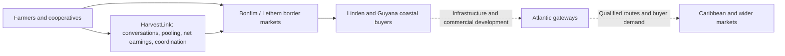

# HarvestLink

### A conversation can open a market.

HarvestLink helps smallholder farmers in Guyana and northern Brazil turn individual harvests into coordinated buyer orders. Farmers talk to an assistant through **WhatsApp or SMS**, in English or Portuguese. The assistant builds their account in the background, asks for missing harvest details, finds compatible demand, compares what they keep after costs, and helps prepare the next step. Farmers confirm the decisions that affect their records and sales.

The **web workspace is the CRM and marketplace**: a place to inspect accounts, availability, buyer proposals, costs, logistics and exporter handovers. The installed phone companion carries the essential conversation and records into places without reliable internet.

[Open the workspace](https://declanroye.github.io/HarvestLink/?release=v22) · [Try the WhatsApp demo](prototype/DEMO-WHATSAPP.md) · [Connect your phone](prototype/SHARED-SETUP.md)

## The problem: a better road does not automatically create a better sale

A farmer has a harvest. A buyer needs a dependable quantity, grade and delivery window. A transporter needs a viable load. An exporter needs clear ownership, farmer consent and unresolved checks made visible. Those pieces can remain scattered across conversations, languages and disconnected records.

A higher quoted export price can also hide a worse outcome once freight, packaging, handling, losses, fees and currency conversion are deducted. A small farmer needs an understandable net comparison, not just a price listing. Our product hypothesis is that pooling compatible availability and making the coordination explicit can help more farmers participate in larger orders. That hypothesis still needs field validation; we do not claim measured income or waste reductions.

## Why this region, why this corridor

The emerging Guyana–Brazil connection links **Manaus → Boa Vista → Bonfim → Lethem → Linden → Guyana's coast**. Brazil's wider **Rota Ilha das Guianas** connects northern Brazilian states with Guyana, Suriname, French Guiana and Venezuela. The connection at Bonfim–Lethem already exists; the opportunity comes from improving the wider network and the commercial coordination around it. [Brazil's integration programme](https://www.gov.br/planejamento/pt-br/assuntos/noticias/2025/novembro/ministerio-do-planejamento-e-orcamento-apresentara-o-programa-rotas-de-integracao-sul-americana-na-cop-30)

The Linden–Lethem corridor is a bilateral infrastructure priority. The Linden–Mabura upgrade has documented CDB/UK financing, while completion of the whole route and river crossings remains a separate challenge. Guyana's Agriculture Ministry connects the corridor and proposed port development at Parika to agricultural trade with Roraima. These are infrastructure projects at different stages, not an already completed export highway. [Bilateral priority](https://dpi.gov.gy/linden-lethem-road-completion-priority-for-guyana-and-brazil/), [CDB project financing](https://www.caribank.org/work-with-us/procurement/procurement-notices/linden-mabura-hill-upgrade-project-general-procurement-notice), [Agricultural cooperation, April 2026](https://agriculture.gov.gy/2026/04/06/guyana-brazil-deepen-agricultural-cooperation-amid-major-infrastructure-push/)

The September 2026 corridor developments also matter: Guyana reported Qatar discussions about financing a proposed Berbice deep-water port, with Bechtel studies underway, and subsequently described anticipated US EXIM involvement in port, energy and other infrastructure, including Lethem Airport. **Financing discussions and expected support are not completed financing, construction or operational capacity.** HarvestLink's opportunity is to prepare the producer-to-buyer coordination layer as connectivity improves. [Port study and financing discussions, 18 September 2026](https://dpi.gov.gy/port-financing-structure-will-determine-refinery-investment-pace-pres-ali/), [Reported EXIM involvement, 22 September 2026](https://dpi.gov.gy/us-exim-bank-to-support-financing-for-gte-phase-two-deepwater-port/)



This is a market-development thesis. It does not promise that every crop can cross every border, that produce qualifies for preferential access, or that a proposed port makes a shipment viable. Start with local and border demand, validate route economics and requirements, then expand.

## What the region can supply

| Production opportunity | Why it matters for HarvestLink |
| --- | --- |
| Roraima: rice, cassava, maize, bananas and horticultural produce; soybean production is also significant | Different crops, grades and harvest windows require different aggregation and logistics. IBGE records a broader agricultural base than the tomato demonstration. |
| Guyana: rice, root crops, fruits, vegetables, coconut and emerging crop diversification | Producer networks can serve local buyers and processors before pursuing regional demand. |
| Higher-value regional supply chains | Grading, packing, processing, reliable collection and records can matter as much as raw production volume. These are future partner opportunities, not services the demo already delivers. |

Sources: [IBGE agricultural production in Roraima](https://www.ibge.gov.br/explica/producao-agropecuaria/rr), [Guyana's agricultural diversification](https://agriculture.gov.gy/2025/07/17/transforming-fields-how-guyanas-investments-fuel-agricultural-growth/).

CARICOM's statistics portal reports **US$5,120.9 million in total food imports in 2024**. Its regional food-security initiative was extended to 2030, and its September 2026 agriculture discussions again emphasised transport, logistics, standards and trade barriers. That is a substantial demand context, not HarvestLink's revenue forecast or addressable market estimate. Our intended path is to help qualified producers and buyers build dependable supply relationships within that wider opportunity. [2024 trade figures](https://statistics.caricom.org/), [2030 initiative](https://caricom.org/food-security-initiative-expanded-extended-to-2030/), [September 2026 priorities](https://cwa2026.caricom.org/caribbean-agriculture-ministers-call-for-deeper-regional-integration-and-redefined-financing-to-achieve-food-security/)

## What the farmer experiences

1. **Text the number.** Choose EN or PT, give consent, name and production area, then confirm the profile. No web registration is required for WhatsApp use.
2. **Describe the harvest naturally.** “Help me sell 120 kg of tomatoes.” The assistant reuses saved context and asks for missing grade, date and local price.
3. **Confirm availability.** A lot remains a draft until confirmation. Availability is not verified quality or a sale.
4. **Ask for a plan.** “What is my best option?” The assistant checks compatible proposals, pooled quantity and dated net-earnings assumptions.
5. **Decide, then coordinate.** Review every deduction, confirm the choice, and prepare a reviewed exporter handover. Buyer acceptance and unresolved trade/transport checks remain visible.
6. **Continue without signal.** The previously installed companion runs the same local conversation and calculation tools. Records stay on the phone until explicit synchronization; conflicts require review.

## Three surfaces, one account

| Surface | Role |
| --- | --- |
| WhatsApp / SMS | Everyday assistant: onboarding, harvests, account changes, offers, plans and confirmed decisions. Requires provider connectivity. WhatsApp Sandbox is deployed; SMS requires a configured sender. |
| Offline phone companion | Local intent inference, structured dialogue, account/lot records, plans and dated comparisons after installation and caching. No offline live market refresh or message delivery. |
| Web CRM / marketplace | Review the linked account, market proposals, shared activity, costs, logistics and handovers. Shared snapshots refresh while the marketplace is open. |

A verified pairing code links the companion to the WhatsApp-created farmer ID. Matching names never merge accounts. Per-device credentials scope access; uploads use revisions, receipts and explicit conflict review. Channel/device assistant goals currently remain local to that session; confirmed lots and choices use the shared account backend.

## What is working today

- English/Portuguese onboarding and intake; seven supported crops: tomatoes, cassava, maize, rice, beans, bananas and papayas.
- Persistent goal-based guidance, owner-scoped memory, offer comparisons, natural-language routing and suggestions for the next action.
- A learned character-ngram logistic-regression intent classifier: **125,597-byte model pack + 2,587-byte inference runtime**. Structured extraction, planning and confirmations are deterministic tools around it; this is not an open-ended generative LLM.
- Paired Twilio Functions using one bounded Sync store, signed inbound handling, retry/deduplication, verified linking and durable account records.
- Simulated buyer orders, compatible pooling, dated BRL/GYD cost comparisons, unbooked transport examples and farmer-confirmed exporter handovers.
- Offline caching and local persistence; owner-scoped synchronization with conflict checks.
- **41 passing unit/integration tests** at this release. Desktop browser inference was measured at approximately 0.10 ms median and 0.30 ms p95 across 100 samples, excluding rendering. These are desktop results, not budget Android measurements.

English onboarding has been demonstrated in a real WhatsApp exchange. End-to-end participant pairing, the complete real-phone commercial workflow, physical Android timings/airplane-mode evidence and bilingual human template sign-off remain outstanding.

## Demo versus roadmap

**Bonfim tomatoes → Lethem is one example, not the whole product.** Send DEMO MARKET to opt into fictional demand and an explicitly fictional 80 kg partner lot. Your 120 kg can fill a 200 kg tomato proposal; illustrative earnings are BRL 390.00 locally versus BRL 530.25 under the proposed cross-border route. Costs are dated 2026-10-03 and valid through 2026-10-10. No live price, buyer, freight, customs or compliance feed is connected.

All cross-border records remain **awaiting buyer confirmation and trade-requirement checks**. The demo never authorizes dispatch. The current Sync-document backend is bounded hackathon infrastructure, not a production multi-tenant marketplace.

Next milestones: farmer/cooperative field interviews; real buyer and carrier partnerships; role-based multi-account CRM; production database and authorization; independent EN/PT accuracy testing; physical phone proof; crop-specific quality/cold-chain workflows; live cost feeds; and qualified export/import review. A more general conversational model is a future capability, not implied by the current agent-like interaction.

## Run and inspect

```sh
cd prototype
npm ci
npm start
npm test
```

Node 22+; local workspace: http://127.0.0.1:4173. Provider credentials stay server-side and are excluded from Git.

[Setup](prototype/SETUP.md) · [Shared deployment](prototype/SHARED-SETUP.md) · [WhatsApp demo](prototype/DEMO-WHATSAPP.md) · [Product journey](prototype/PRODUCT.md) · [Physical-phone evidence protocol](prototype/PHONE-TEST.md)

Research checked **4 October 2026** against linked government, regional and statistical sources. Project announcements are attributed to their publishers; market opportunity and proposed product expansion are our interpretation.
