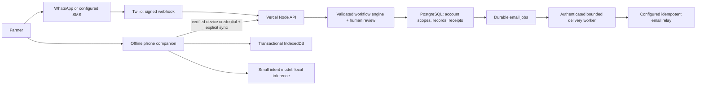

# Architecture, security and operational boundaries

HarvestLink is a messaging-first coordination assistant. WhatsApp/SMS carry online conversations; the phone companion captures and reviews work offline. The CRM reflects records rather than pretending messaging is available without a network.

## Enforced controls

- Provider webhook signatures are validated before inbound messages reach account workflows. Ordinary phone text cannot invoke shell commands, SQL, arbitrary URLs or unrestricted email tools.
- Temporary pairing requires a message from the farmer's messaging account and an explicit confirmation. Device credentials are hashed on the service; browser exports and secondary localStorage recovery backups exclude bearer tokens and pairing secrets. IndexedDB still contains device credentials and personal records: this is origin isolation, not PIN encryption.
- Account-scoped PostgreSQL transactions prevent concurrent writes from silently replacing each other. Record reads and writes remain scoped to the verified account. Parameterized SQL is used. This is application-level isolation, not PostgreSQL RLS certification.
- Durable provider receipts retain response/idempotency information beyond the bounded account conversation history. A reused provider SID with changed input is rejected. No automatic receipt purge is configured; retention and deletion need an operator policy before real usage.
- Incoming messages are bounded at 1,000 characters. API bodies are bounded at 100 KB. Per-sender and per-device rate controls are enforced in shared state, though account-local limiting is not a substitute for edge DDoS controls.
- Unknown server failures return generic errors. Database internals are not exposed to users. Vercel responses set CSP, nosniff, referrer and browser permission policies. The CSP permits the current Twilio bridge and same-origin API; adding another coordinator host requires an explicit configuration change.
- Browser synchronization times out after 15 seconds, preserves operation IDs and retries already-authorized work with backoff. Conflicts require review. Offline edits do not accept buyer orders, book transport or clear customs.
- Model assets are checked against pinned SHA-256 hashes before loading. This catches mismatched/corrupt files; it is not independent code signing. Model confidence is used to request clarification, not as proof of a correct commercial decision.

## AI capabilities and limits

The deployed compact model is a character n-gram logistic-regression intent classifier, with bilingual deterministic extraction and reviewed response templates. Grounded workflow code compares dated costs, compatible harvest lots and illustrative buyer orders. It is not a general-purpose language model, speech recognizer, live market oracle or customs adviser. Model training uses synthetic domain utterances; field accuracy and physical budget-Android latency remain unverified. A stronger future language model should propose typed actions to the same validator/review boundary rather than receive direct database or delivery authority.

## Messaging and documents

SMS and WhatsApp share the workflow engine. SMS replies are divided into numbered parts below the provider's individual-message limit, preserving reviewed content. Multipart SMS can contain multiple billable segments. A real SMS sender and carrier delivery test are still required. Phone identities across channels are not silently merged by matching names or inferred ownership.

Document generation snapshots confirmed farmer facts. Preparing and emailing a draft require separate explicit confirmations. Email status distinguishes queued work, provider acceptance and actual delivery; no delivery webhook has been configured. The free Vercel-compatible daily drain is a demo schedule, not a timely production email service.

## Deployment and data protection work still required

The current Vercel API fails closed while PostgreSQL is unconfigured. The live Twilio demo remains on its bounded Sync store until migration and channel switching are completed. Both hardened Twilio handlers were deployed and the Console confirmed the latest version is deployed on 4 October 2026. This verifies deployment, not a new real SMS delivery or WhatsApp exchange.

Before accepting real sensitive records: choose the database provider and region, review provider contracts and processing roles, configure least-privilege database credentials, backups and tested restore, retention/deletion across records, receipts and provider logs, incident response and access auditing. Device storage needs a deliberate shared-phone/PIN strategy. Do not claim GDPR/LGPD compliance, encryption at rest, disaster recovery objectives or production scale solely from this code.

Scale Vercel functions independently from PostgreSQL using pooled database connections; a small per-instance pool and five-second connection acquisition timeout bound amplification. Provider connection quotas, migration locking on cold starts and the pairing control row remain capacity constraints. CI tests exercise PostgreSQL isolation, retries, large records and a two-worker Nginx deployment; they do not measure Vercel capacity or establish an SLA.
