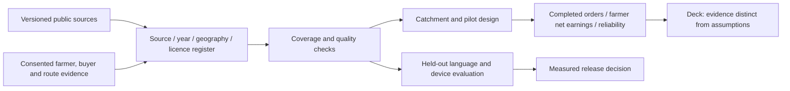

# HarvestLink: evidence, datasets and deck narrative

Research checked 4 October 2026. The supplied hackathon resource list is a starting point, not an analysis already performed. **None of the external datasets below has been ingested into this release or used to train its current model.** The current classifier uses an authored synthetic EN/PT corpus; market orders and prices remain illustrative.

## Why this solution

The corridor opportunity has three layers: physical access, commercial coordination and usable digital access. Roads can connect places; they cannot establish a farmer's available quantity, buyer acceptance, net margin or cleared shipment. HarvestLink turns an everyday conversation into reviewed records and a coordinated next step, with the web app serving as CRM/marketplace and the cached companion preserving essential work without signal.

This is a product hypothesis supported by infrastructure and regional demand context, not evidence of achieved income improvement. Farmer interviews, buyer commitments, completed deliveries and measured net earnings must establish impact.

## A. Language and speech: understand the farmer, preserve the facts

| Resource and primary source | Proposed HarvestLink use | Fit and limits |
| --- | --- | --- |
| [Mozilla Common Voice](https://www.mozillafoundation.org/pt-BR/common-voice/) and [dataset catalogue](https://commonvoice.mozilla.org/en/datasets) | Explore EN/PT speech data for a future voice-note interface; contribute separately consented local recordings where permitted | Crowdsourced speech is not a representative farmer sample. Check exact release, accent coverage, data access terms and licence; CC0 corpus licensing does not remove catalogue access conditions. Voice inference is not currently implemented. |
| [Google FLEURS](https://research.google/pubs/fleurs-few-shot-learning-evaluation-of-universal-representations-of-speech/) | Public baseline for speech recognition/language identification before testing real farm voice notes | 102-language parallel benchmark, roughly 12 hours per language. Published benchmark results must be supplemented with local accent, background noise, crop names and unit/date tests. |
| [Meta MMS](https://github.com/facebookresearch/fairseq/tree/main/examples/mms) | Investigate speech recognition/synthesis for future languages with limited resources | Speech models cover over 1,000 languages; coverage alone does not establish local usability. Large checkpoints are not the current small phone model. Review checkpoint licences, memory and device latency; the linked fairseq repository is archived. |
| [FLORES-200](https://github.com/facebookresearch/flores) / [NLLB model card](https://huggingface.co/facebook/nllb-200-distilled-600M) | Evaluate future translation and compare model outputs with reviewed EN/PT buyer templates | FLORES is evaluation data; NLLB is a model family. Check the exact checkpoint's non-commercial licence and intended-use restrictions before deployment. Benchmark translation is not trade-document certification. Preserve quantity, grade, currency, dates and negation. |
| [OPUS](https://opus.nlpl.eu/) | Select EN/PT parallel text for future translation adaptation and terminology tests | Domain and licence vary by corpus; generic subtitles or web text are not agricultural/trade ground truth. Audit provenance, duplication and leakage. |
| [Amazon MASSIVE paper](https://arxiv.org/abs/2204.08582) and [official resource](https://www.amazon.science/code-and-datasets/massive) | Compare compact multilingual intent/slot approaches, then add a local agricultural corpus | The published benchmark describes over one million examples across 51 languages, including English and Portuguese. The official landing-page description currently says 52: record the exact release rather than mixing counts. General assistant intents do not directly label harvest sales. |
| [Masakhane](https://www.masakhane.io/) | Learn from community-led language collection and evaluation; assess relevance for a future African expansion | African-language resources are not direct evidence for Guyana or Roraima. Local communities should shape language priorities and consent. |
| [AI4Bharat / IndicVoices](https://github.com/AI4Bharat/IndicVoices/blob/master/README.md) | Learn from natural, conversational speech collection; possible future South Asian expansion | Indian-language datasets do not demonstrate local Guyanese language coverage. Do not infer applicability from ancestry. Select actual user languages through interviews. |

The immediate priority is **a consented, de-identified local EN/PT agricultural evaluation set**, with farmers separated between training and testing. Measure intent macro-F1, abstention, exact crop/quantity/date/price extraction, clarification turns and confirmation errors. Voice should be a separate evaluated capability; a voice demo must not be implied by a text classifier.

## B. Connectivity, devices and inclusion: design around access

| Resource | Decision it can inform | What it cannot establish |
| --- | --- | --- |
| [GSMA Mobile Gender Gap 2025](https://www.gsma.com/gender-gap-2025/) | Recruitment and access questions: personal/shared handset, affordability, digital skills, gender and safe use | Regional/modelled estimates are not Bonfim or Lethem farmer statistics. Do not transfer African or South Asian gaps to this region. |
| [OpenCelliD](https://opencellid.org/) | Candidate tower-location layer for planning a connectivity survey | Missing observations are not proof of no signal; tower proximity is not usable service, capacity or indoor coverage. Check timestamps, provider identifiers, licence and local sampling. |
| [Anatel mobile coverage](https://www.gov.br/anatel/pt-br/dados/qualidade/qualidade-dos-servicos/mapa-cobertura) / [modelled coverage maps](https://sistemas.anatel.gov.br/se/public/cmap.php) | Brazil-specific comparison with crowdsourced tower records | Modelled coverage requires on-site validation; municipality coverage does not guarantee farm or road coverage. Survey the Guyanese side separately. |
| [World Bank Global Findex 2025](https://www.worldbank.org/en/publication/globalfindex/download-data) | Country/year/subgroup evidence on accounts, payments, phone ownership and internet access where available | Missing country/indicator observations are not zero. Verify Guyana and Brazil separately before charting. Account ownership does not establish cross-border payout readiness; no payment rail is implemented. |

The [2025 Findex report](https://www.worldbank.org/en/publication/globalfindex/report) uses 2024 surveys across 141 economies. This makes it useful for inclusion context, not real-time user profiling. Ask each participant which device/channel they can actually use. SMS can lower the smartphone requirement but still needs network service and a configured sender; offline assistance requires a cached smartphone companion.

## C. Maps, population and satellite: choose the catchment responsibly

| Resource | Proposed application | Interpretation limit |
| --- | --- | --- |
| [WorldPop](https://www.worldpop.org/) | Estimate population within a clearly defined service area, compare settlements and plan interviews | Modelled population is not a count of farmers, smartphone users, reachable customers or paid users. Record year, resolution and constrained/unconstrained method. |
| [OpenStreetMap](https://www.openstreetmap.org/copyright) | Offline base maps, collection points and candidate road networks | Map completeness and road condition vary. Roads do not prove travel time, border admissibility or refrigerated capacity. Respect ODbL attribution and applicable tile-service policies; no offline map is bundled today. |
| [VIIRS Nighttime Lights](https://eogdata.mines.edu/products/vnl/) | Supporting spatial context for settlement activity/electrification hypotheses | Night radiance is a proxy affected by lighting, clouds and other artifacts. It does not measure farm yield, mobile signal or individual access to electricity. It is not a crop-health dataset. |

For a pilot, combine dated map layers with cooperative rosters, consented visits, carrier route checks and measured network/device tests. Do not turn a raster population estimate into a market-size claim without observed eligibility and adoption.

## D. Country statistics and household surveys: ground the regional story

The supplied section D had no dataset entries; these are relevant additions, not quoted contents of that section.

- **Brazil:** [IBGE production in Roraima](https://www.ibge.gov.br/explica/producao-agropecuaria/rr) describes the crop base; [PNAD Contínua](https://www.ibge.gov.br/estatisticas/multidominio/genero/17270-pnad-continua.html) provides household/device/internet context. Select the correct geography, reference year, survey weights and uncertainty. State-level estimates do not describe every border community.
- **Guyana:** [Bureau of Statistics](https://statisticsguyana.gov.gy/) census releases and [household surveys](https://statisticsguyana.gov.gy/surveys/) can inform population, livelihoods and expenditure context. Check published tables and their reference period; do not assume a proposed census or a questionnaire constitutes released results.
- **Regional demand:** [CARICOM statistics](https://statistics.caricom.org/) supplies the dated food-import context cited in the README. Total imports are neither HarvestLink's serviceable market nor evidence that a particular farmer's crop can replace imports.

## Proposed evidence workflow

No automatic external-data ingestion exists today. Future imports should preserve source version, licence, geography, reference date, transformation and missingness. Public-source facts, demo assumptions, interview findings and measured outcomes should have separate labels.

## Deck-ready story

| Slide | Claim to make | Evidence or visual | Label to retain |
| --- | --- | --- | --- |
| 1. The opening | Guyana–Brazil connectivity creates a commercial coordination opportunity | Corridor map, official infrastructure sources and documentary crossing photo | Announced/planned versus operating infrastructure |
| 2. The farmer's problem | Individual harvests must meet buyer quantity, quality, timing and route economics | Farmer journey and proposed interviews | Product hypothesis until interviews validate it |
| 3. Why messaging + offline | A useful service must work with the participant's actual language, channel, device and connection | GSMA/Findex context, national statistics, local phone/network tests | Context is not local adoption proof |
| 4. Why small AI | Bounded intent recognition and validated tools can run locally with a compact pack | Measured 128,184-byte model-plus-runtime; dataset/evaluation plan | Current text model; desktop timings, Android pending |
| 5. How a sale is coordinated | Confirmed availability becomes a compatible pool, transparent net comparison and reviewed handover | Architecture and labelled 120 kg + fictional 80 kg demonstration | Buyer acceptance and trade checks pending |
| 6. How we prove impact | Test the commercial relationship as well as the software | Completed orders, net receipts, clarification errors, sync reliability and device benchmarks | Targets until measured; no invented impact percentages |
| 7. The moonshot | Extend verified producer networks into qualified regional and wider markets | Roadmap plus data/partner integration architecture | Future ambition, not deployed capability |

**Suggested pitch:** “HarvestLink helps a farmer turn a message into a market-ready opportunity. It combines a bilingual assistant, confirmed harvest records, compatible pooling and transparent net earnings, while an offline companion keeps essential work available without signal. As Guyana and northern Brazil improve their connections, HarvestLink aims to make those routes commercially usable for small producers—not just visible on a map.”
