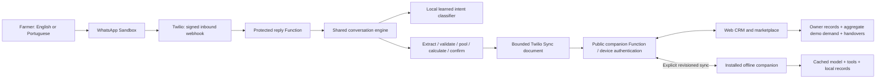
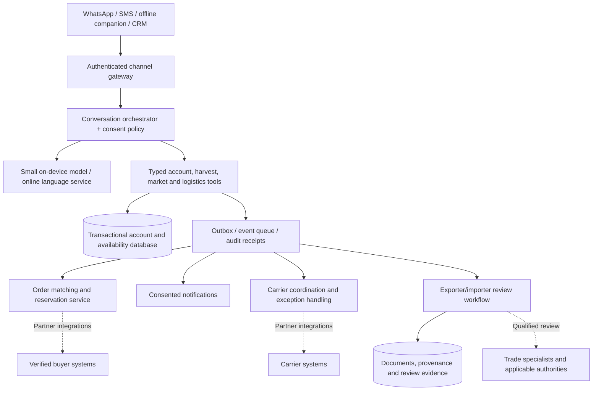

# HarvestLink technical specification

**Status: hackathon implementation plus proposed production design. Updated 4 October 2026.** The current small AI is a learned intent classifier with structured tools, not a general-purpose LLM. This document separates deployed behavior from the next architecture.

## Deployed architecture



Twilio and local Node hosting are alternative server adapters. The production demo uses paired Twilio Functions; local development uses the Node server. Provider credentials never enter the client. SMS uses the same conversation adapter when a sender and webhook are configured; the deployed proof currently uses WhatsApp Sandbox.

## One interaction, from text to a confirmed record

```mermaid
sequenceDiagram
  actor F as Farmer
  participant W as WhatsApp
  participant E as Conversation engine
  participant T as Validated tools
  participant S as Account store
  F->>W: EN / PT, consent, name, area
  W->>E: Signed inbound message + provider message ID
  E-->>F: Review profile; ask for confirmation
  F->>E: CONFIRM
  E->>S: Save stable farmer ID
  F->>E: Help me sell 120 kg of tomatoes
  E->>T: Recognize intent, extract known fields
  E-->>F: Ask only for missing grade, date, local price
  F->>E: Complete details; CONFIRM
  E->>S: Persist confirmed lot
  F->>E: What is my best option?
  E->>T: Check compatibility, pool and dated costs
  T-->>E: Net estimates + assumptions + unresolved checks
  E-->>F: Explain recommendation; request choice
  F->>E: Choose proposal; CONFIRM
  E->>S: Save choice snapshot; no dispatch authorization
```

## Implementation contract

| Component | Current specification | Production requirement |
| --- | --- | --- |
| Runtime | Node 22+; browser ES modules; no client build step | Versioned deployments, observability and rollback |
| AI | EN/PT character 3–5-gram logistic-regression classifier; 125,597-byte model pack, 2,587-byte inference runtime | Independent farmer-language evaluation, robust abstention, model release tracking |
| Conversation | Language-first onboarding; persistent drafts; bounded goal routing; validated crop fields and human confirmation | Broader conversational understanding with tool execution constrained by authorization |
| Identity | WhatsApp provider identity creates stable account ID; verified pairing connects a device | Secure recovery, device revocation, cooperative/buyer/carrier roles |
| Pairing | Expiring 8-character code, 10-minute lifetime; farmer confirmation; per-device bearer credentials and basic rate limits | Stronger abuse detection and complete credential lifecycle |
| Shared storage | One bounded Sync document; 14,500-byte application guard; durable owner-scoped records | Transactional database, row-level authorization, immutable event log and object storage |
| Sync | Explicit uploads, expected revisions, receipts, conflict response; no merge by name | Durable outbox, idempotency keys, background retry and reviewed conflict resolution |
| Local storage | Service-worker cache and localStorage for account/drafts/confirmed records/snapshots | IndexedDB transactions, migration/backup policy, capacity checks and native encrypted storage where appropriate |
| Marketplace | Three opt-in fictional demand records, compatible pool computation; visible view refreshes roughly every 15 seconds | Authenticated buyer orders, reservation/expiry, availability ledger; event-driven updates |
| Logistics | Illustrative carrier/route/cost record; nothing booked | Carrier acceptance, collection slots, status events and cold-chain evidence |
| Import/export | Farmer-confirmed handover and unchecked requirements | Qualified importer/exporter review, crop/destination-specific evidence, explicit clearance state |

Core records are account, session/draft, lot, order, cost assumptions, choice snapshot and handover. Lots carry farmer ownership, crop, quantity/unit, grade, harvest date, area and farmer confirmation. Comparisons preserve their input assumptions rather than silently repricing a saved decision. Handover records identify the confirmed allocation and pending checks; demo dispatch remains false.

**Calculation:** convert the quoted buyer currency using the dated FX assumption; deduct allocated freight, packaging, handling, service fees and modeled losses. Compare this estimated net with the local-sale net for the same allocated quantity. Pooling must respect crop, grade, location/route and harvest window; never count synthetic partner lots as real farmer inventory. A recommendation is conditional on the freshness and completeness of its inputs.

## Offline behavior

The companion must be opened and cached online before loss of signal. It then loads the same model and local tools, captures harvests, asks missing-field questions, saves confirmed choices and computes against saved dated assumptions. Restarting preserves records unless site data is cleared. WhatsApp itself cannot receive an assistant reply offline, and an offline snapshot cannot establish current demand or book transport.

On reconnection the farmer explicitly synchronizes. The server checks ownership and revisions and returns a receipt or a conflict requiring review. Current offline handovers must be recreated through the connected messaging flow after confirmed choices sync; they do not yet upload as handover events. Session goals remain local to each channel/device. These are implementation gaps, not hidden background automation.

## Proposed production architecture



This diagram is a target design, not deployed infrastructure. The online model would propose tool calls; typed validation, ownership checks, confirmation and state transitions remain authoritative. External price, weather, carrier and trade data need provenance and freshness. No model may declare customs clearance or bind a farmer to an unreviewed sale.

## Release evidence and acceptance gates

The existing suite contains 41 unit/integration tests covering dialogue, owner scoping, pooling, calculations, shared API behavior and Twilio integration. Desktop response measurements do not prove budget Android performance. Before a field pilot: complete real WhatsApp-to-companion pairing; record a full harvest-to-handover exchange; test airplane mode and restart on a physical budget phone; collect model size/latency/memory results; obtain bilingual template review; test duplicate delivery, stale prices, concurrent edits and failed sync. Production additionally requires security, load, database migration and operational recovery testing.
